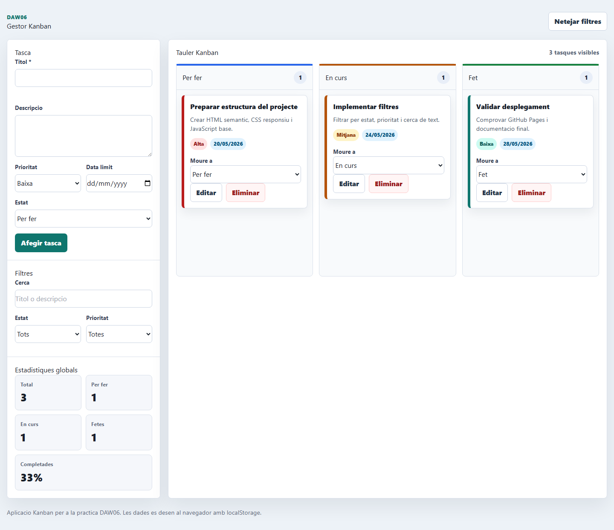

# Kanban DAW06

Aplicacio web de gestio de tasques tipus Kanban creada amb HTML, CSS i JavaScript per a la practica DAW06.

## Que permet fer

- Crear, editar i eliminar tasques amb titol, descripcio, prioritat, data limit i estat.
- Organitzar les tasques en tres columnes: Per fer, En curs i Fet.
- Moure tasques entre columnes amb un selector d'estat.
- Filtrar per estat i prioritat.
- Cercar text al titol i a la descripcio.
- Veure estadistiques globals: total, tasques per estat i percentatge completat.
- Mantenir les dades desades al navegador amb `localStorage`.

## Guia rapida d'us

1. Omple el formulari lateral amb el titol de la tasca i, si cal, descripcio, prioritat, data limit i estat.
2. Prem `Afegir tasca` per crear-la.
3. Usa el selector `Moure a` dins de cada targeta per canviar-la de columna.
4. Prem `Editar` per modificar una tasca o `Eliminar` per esborrar-la amb confirmacio.
5. Usa el camp de cerca i els selectors de filtres per combinar criteris.
6. Prem `Netejar filtres` per tornar a mostrar totes les tasques.

## Estructura del projecte

```text
index.html
css/estils.css
js/script.js
img/
docs/proces.html
docs/proces.pdf
README.md
```

## Enllacos

- Repositori GitHub: https://github.com/alvarojimenez-DAW/DAW06
- GitHub Pages: https://alvarojimenez-daw.github.io/DAW06/

## Captures de pantalla



## Issues Scrum proposades

1. Inicialitzacio del projecte i estructura base.
2. Model de dades i persistencia amb localStorage.
3. CRUD complet de tasques i renderitzacio del Kanban.
4. Filtres, cerca i estadistiques.
5. Responsive, Git flow, desplegament, README i PDF final.
